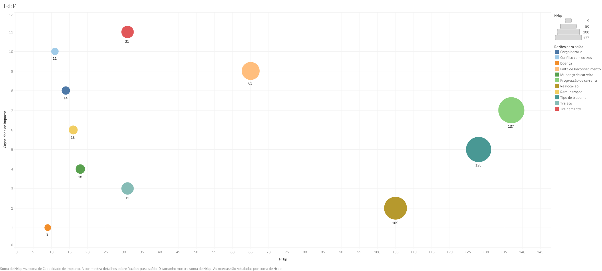
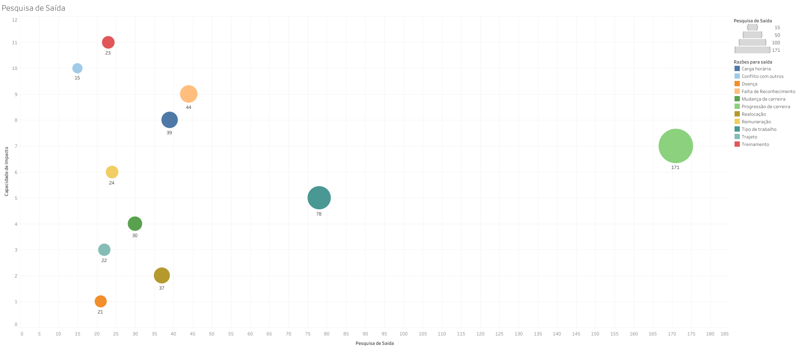
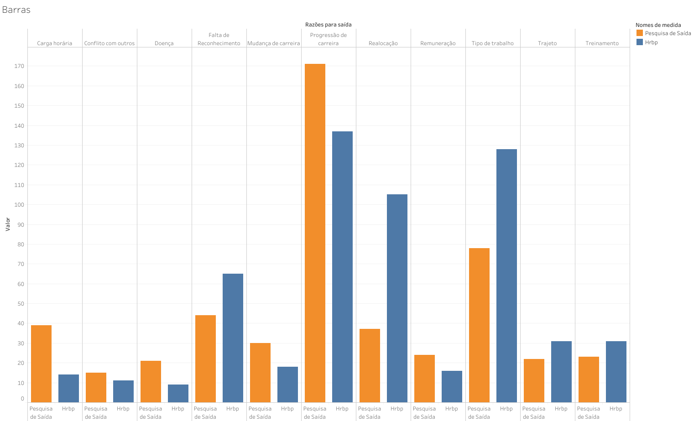
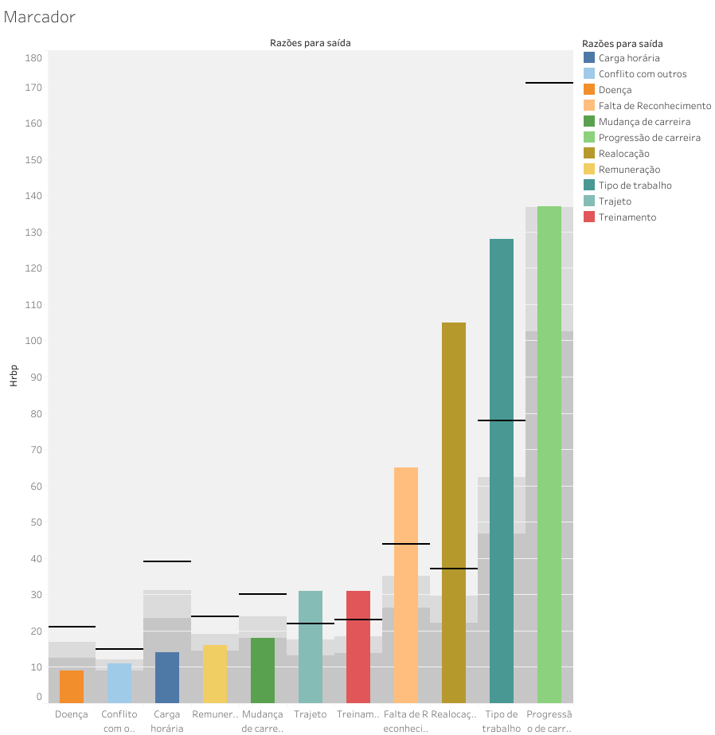
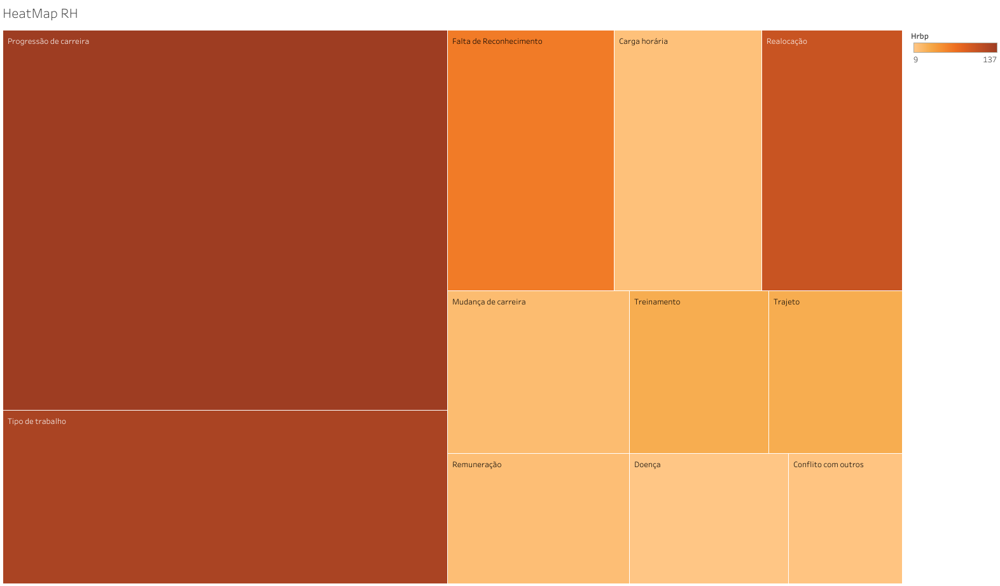
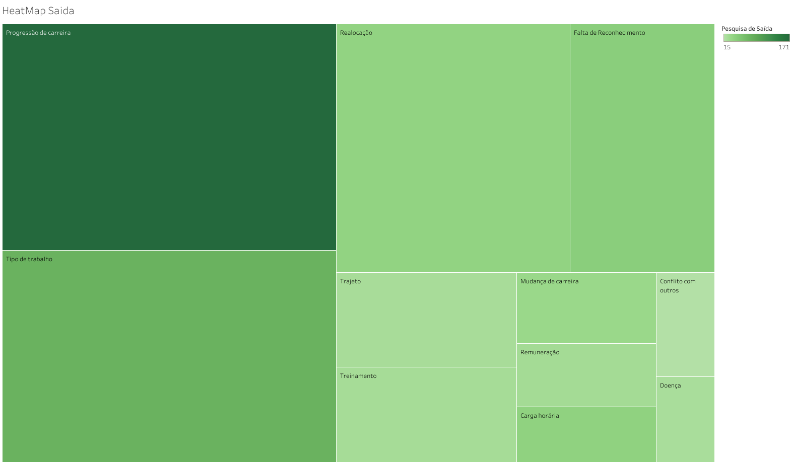

<h1 align="center">
 
</h1>

# Projeto Individual - Módulo 5: Pessoas Deixando a Empresa

## Contexto

>Seu HRBP forneceu uma visualização inicial em forma de gráfico de bolhas, destacando as razões para a saída dos funcionários da empresa. As situações apresentadas incluem conflito com outros, falta de reconhecimento, carga horária, progressão de carreira, remuneração, tipo de trabalho, mudança de carreira, trajeto, realocação e doença.

Este projeto visa utilizar o Tableau para criar dashboards que identifiquem as razões para a saída dos funcionários da empresa, destacando áreas como **conflito com outros**, **falta de reconhecimento**, **carga horária**, **progressão de carreira**, **remuneração**, **tipo de trabalho**, **mudança de carreira**, **trajeto**, **realocação** e **doença**. O objetivo final é não apenas compreender esses motivos, mas também analisar seus impactos e propor soluções para mitigar o atrito de pessoal na organização.

## Como Executar

- Faça o download do arquivo Tableau [aqui](Data/ProjetoIndividual5.twbx).
- **Tableau:** Instale a versão mais recente do [Tableau](https://www.tableau.com/pt-br/trial/download-tableau).
- ❗️❗️❗️ **Sugiro fortemente** que você acesse o dashboard pela [web](https://public.tableau.com/app/profile/cassio.ramos/viz/ProjetoIndividual5_17087108028200/Painel1) para uma melhor visualização dos gráficos ❗️❗️❗️

## StoryTelling

Nossa empresa busca entender os motivos por trás do aumento no número de funcionários que estão deixando a empresa. Para isso, realizamos uma pesquisa detalhada com os colaboradores que saíram, visando identificar suas razões e, se necessário, implementar mudanças para tornar a empresa mais atrativa e satisfatória para os colaboradores.

Inicialmente, o departamento de Recursos Humanos (RH) analisou individualmente as circunstâncias de cada funcionário que se desligou, buscando compreender os motivos subjacentes à sua decisão.

Posteriormente, avaliamos os resultados da pesquisa feita com os ex-funcionários, juntamente com dados comportamentais fornecidos pelo nosso parceiro de negócios de RH. Essa análise conjunta nos proporcionou insights sobre os principais impulsionadores da evasão de funcionários.

Tanto na pesquisa com ex-funcionários quanto nos dados do RH, avanço na carreira e tipo de trabalho foram apontados como principais motivos para a saída. Recomenda-se promover funcionários qualificados e revisar condições de trabalho para reduzir exaustão e aumentar satisfação e engajamento.

## Resultados

### Gráfico do RH

    

Este gráfico destaca as razões para a saída dos funcionários identificadas pelo RH em relação ao impacto. Observamos que categorias como "Progressão de Carreira" e "Tipo de Trabalho" têm um impacto moderado, enquanto "Treinamento" tem um impacto significativo. "Conflito com outros" e "Carga horária" apresentam alta correlação e capacidade de impacto considerável.

### Gráfico da Pesquisa de Saída

    

Este gráfico representa as razões para a saída dos funcionários de acordo com a pesquisa realizada em relação ao impacto. "Progressão de Carreira" é a categoria mais frequente e tem uma capacidade de impacto acima da média. Outras categorias não apresentam correlações significativas.

## Conclusão dos Gráficos

Ambos os conjuntos de dados destacam que questões relacionadas à progressão na carreira e à natureza do trabalho são as principais razões para a evasão dos funcionários. Esses insights podem orientar medidas para promover um ambiente de trabalho mais atrativo e retentor de talentos.

### Gráfico de Barras

    

**O que está sendo mostrado:**
Este gráfico destaca as razões para a saída dos funcionários pelo HRBP em relação à capacidade de impacto. Ele revela que as pesquisas apresentam discrepancia mas aparentam apontar que o principal razão de saida é a "Progressão de Carreira"

### Gráfico com Marcador

    

### **O que está sendo mostrado:**
O gráfico com marcadores é uma ferramenta eficaz para destacar a diferença nos valores entre as Razões para Saída e o RH. Ele proporciona uma representação visual clara das discrepâncias entre esses conjuntos de dados. Isso realça de maneira nítida a divergência nos valores, ressaltando que, embora haja uma variação entre as métricas fornecidas pelo RH e aquelas extraídas da Pesquisa de Saída, há uma consistência notável na identificação da "Progressão de Carreira" como o principal motivo de saída em ambos os conjuntos de dados.

Apesar dessa visualização simplista, pode prejudicar a interpretação, necessitando de que haja algum tipo de descrição sobre o significado das linhas e das colunas.

### HeatMaps

| HeatMapRH | HeatMapSaida |
|-----------|--------------|
|  |  |

### Grafico de Árvore

Um gráfico de árvore pode oferecer uma visualização detalhada da correlação entre cada lista de dados, permitindo uma análise mais profunda dos valores reais. Isso fornecerá uma compreensão mais completa das relações entre as diferentes métricas e categorias de saída dos funcionários. Ao examinar essas relações, destaca-se a importância da "Progressão de Carreira" e do "Tipo de Trabalho" como fatores de saída.

Nesse tipo de gráfico temos a facilidade de interpretação, porém ele não comporta mais de duas variáveis como os outros graficos.

## Qual visualização representa melhor os dados e por quê:

O grafico de Árvore que melhor representa os dados, ja que podemos verificar quais são as situações que mais têm contribuído para a saída de funcionários da empresa com relação ao tamanho e podemos também verificar os níveis de capacidade de impactar com relação às cores. Conseguimos tabem ver quais surgem mais em cada tabela, seja pelo RH ou pela Pesquisa feita, sendo assim coseguimos ter uma noção melhor de qual seriam os valores reais.

## Conclusão

>Identificamos que questões relacionadas à progressão na carreira e à natureza do trabalho são as principais razões para a evasão dos funcionários. 
>
>Propomos medidas como promoções e reformulação das atividades para mitigar esses problemas e promover um ambiente de trabalho mais atrativo e retentor de talentos.
