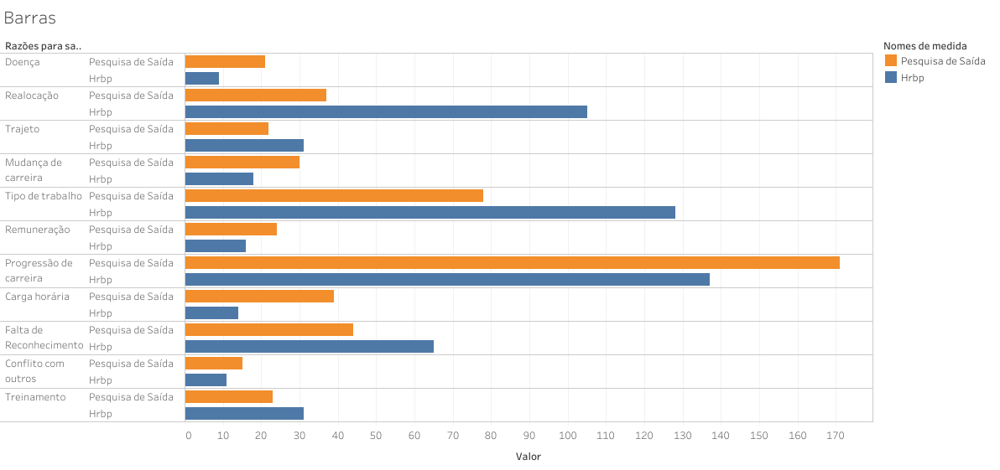

<!--
<h1 align="center">
 
</h1>
-->

# Projeto Individual - Módulo 5: Pessoas Deixando a Empresa

## Contexto

>Seu HRBP forneceu uma visualização inicial em forma de gráfico de bolhas, destacando as razões para a saída dos funcionários da empresa. As situações apresentadas incluem conflito com outros, falta de reconhecimento, carga horária, progressão de carreira, remuneração, tipo de trabalho, mudança de carreira, trajeto, realocação e doença.

Este projeto visa utilizar o Tableau para criar dashboards que identifiquem as razões para a saída dos funcionários da empresa, destacando áreas como **conflito com outros**, **falta de reconhecimento**, **carga horária**, **progressão de carreira**, **remuneração**, **tipo de trabalho**, **mudança de carreira**, **trajeto**, **realocação** e **doença**. O objetivo final é não apenas compreender esses motivos, mas também analisar seus impactos e propor soluções para mitigar o atrito de pessoal na organização.

## Como Executar

- O arquivo para Download do Tableau está no repostorio [aqui](Data/ProjetoIndividual5.twbx)
- **Tableau:** Faça o download e instale a versão mais recente do [Tableau](https://www.tableau.com/pt-br/trial/download-tableau).
- ❗️❗️❗️ **Sugiro fortemente** que você acesse o dashboard pela [web](https://public.tableau.com/app/profile/cassio.ramos/viz/ProjetoIndividual5_17087108028200/Painel1) ❗️❗️❗️

## Resultados

### Gráfico de Barras

    

**O que está sendo mostrado:**
Este gráfico destaca as razões para a saída dos funcionários pelo HRBP em relação à capacidade de impacto. Ele revela que categorias discutidas com frequência, como "Progressão de Carreira" e "Tipo de Trabalho", têm um impacto moderado, enquanto "Treinamento", discutido com menos frequência, possui um impacto significativo. Além disso, "Conflito com outros" e "Carga horária" apresentam alta capacidade de impacto e correlação.

**Observações:**
Este gráfico destaca as razões para a saída dos funcionários pelo HRBP em relação à capacidade de impacto. Categorias discutidas com frequência, como "Progressão de Carreira" e "Tipo de Trabalho", têm um impacto moderado, enquanto "Treinamento", apesar de ser discutido com menos frequência, tem a maior capacidade de impacto. "Conflito com outros" e "Carga horária" demonstram alta correlação e possuem uma capacidade de impacto considerável.

---

### Gráfico de Pesquisa de Saída

    

**O que está sendo mostrado:**
Este gráfico representa as razões para a saída dos funcionários em relação à sua capacidade de impacto.

**Observações:**
"Progressão de Carreira" é a categoria mais frequente e tem uma capacidade de impacto acima da média, indicando sua importância para os funcionários ao considerar a saída. Em segundo lugar em frequência está "Tipo de Trabalho", mas sua capacidade de impacto está ligeiramente abaixo da média. Além dessas categorias, não há uma correlação muito forte entre as outras razões para saída, sugerindo que esses aspectos podem não ser tão influentes na decisão de saída dos funcionários.

---

### Gráfico com Marcador

    

**O que está sendo mostrado:**
O gráfico com marcadores é uma ferramenta eficaz para destacar a diferença nos valores entre as Razões para Saída e o RH. Ele proporciona uma representação visual clara das discrepâncias entre esses conjuntos de dados. Isso realça de maneira nítida a divergência nos valores, ressaltando que, embora haja uma variação entre as métricas fornecidas pelo RH e aquelas extraídas da Pesquisa de Saída, há uma consistência notável na identificação da "Progressão de Carreira" como o principal motivo de saída em ambos os conjuntos de dados.

---

### HeatMaps

| HeatMapRH | HeatMapSaida |
|-----------|--------------|
|  |  |

**Grafico de Árvore:**

Um gráfico de árvore pode oferecer uma visualização detalhada da correlação entre cada lista de dados, permitindo uma análise mais profunda dos valores reais. Isso fornecerá uma compreensão mais completa das relações entre as diferentes métricas e categorias de saída dos funcionários. Ao examinar essas relações, podemos identificar padrões significativos, como a consistência notável na classificação da "Progressão de Carreira" como o principal motivo de saída em ambos os conjuntos de dados. Além disso, podemos destacar a consistência na importância do "Tipo de Trabalho" como fator de saída. Essas informações fornecem uma compreensão mais abrangente das dinâmicas subjacentes às decisões de saída dos funcionários.

